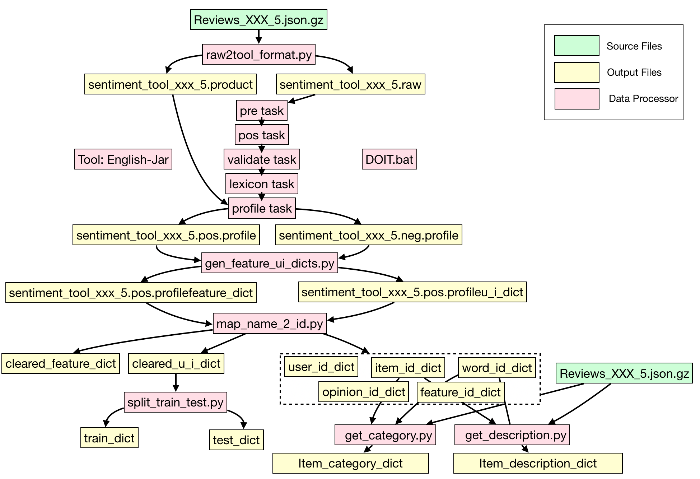

# Conversational

## Instructions on preparing conversation data for model training

The package already includes processed converseation data to train and run the model. It includes four sub-categories from the Amazon dataset. If you are not using the model for new conversation data, you can just play with the code based on the four processed conversation datasets.

If you want to build your own conversation data — e.g., for other sub-categories of the Amazon dataset, or even datasets for other conversation scenarios — we have prepared the following package to achieve this goal, together with a figure to show the flow of the process.

The package for conversation data preparation can be downloaded in this URL:
https://www.dropbox.com/s/3gf4zz02okphjhb/data.zip?dl=0

This follwoing repository provides an instruction about how to use the Sentires phrase-level sentiment analysis toolkit:
https://github.com/evison/Sentires

And the flow of the data preparation process is shown as the following figure.

In general, it includes the follows steps:
```
1. Run raw2tool_format.py to get xxx.raw and xxx.product files
2. Put .raw data into English-Jar/data/raw and use English-Jar (DOIT) to get xxx.pos.profile and xxx.neg.profile
3. Run gen_feature_ui_dicts.py to get xxx.pos.profileu_i_dict and xxx.pos.profilefeature_dict
4. Run map_name_2_id.py to get cleared_u_i_dict, cleared_feature_dict and many other dicts
5. Run split_train_test.py to get train_dict and test_dict
6. Run get_category.py to get item_category_dict
7. Run get_description.py to get item_description_dict
```



## Bibliographic information:

```
@inproceedings{zhang2018towards,
  title={Towards conversational search and recommendation: System ask, user respond},
  author={Zhang, Yongfeng and Chen, Xu and Ai, Qingyao and Yang, Liu and Croft, W Bruce},
  booktitle={Proceedings of the 27th ACM International Conference on Information and Knowledge Management},
  pages={177--186},
  year={2018},
  organization={ACM}
}
```
